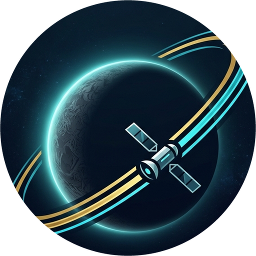
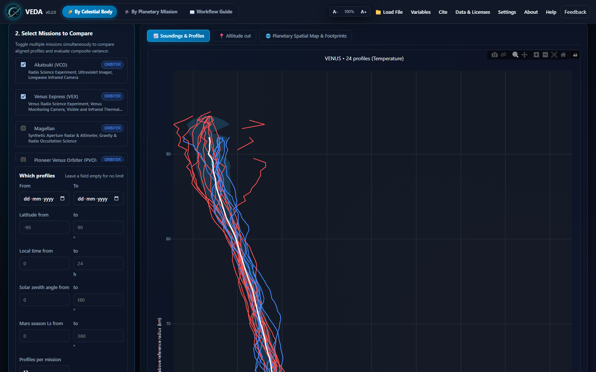
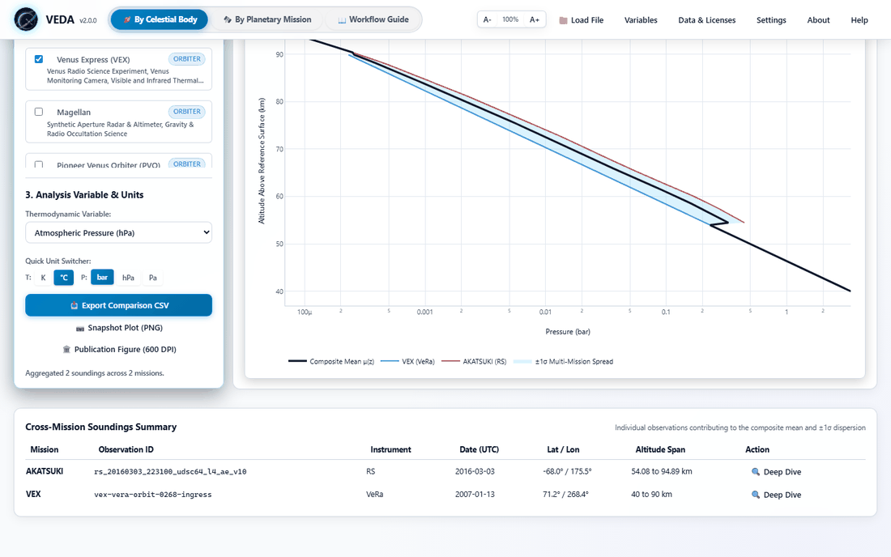
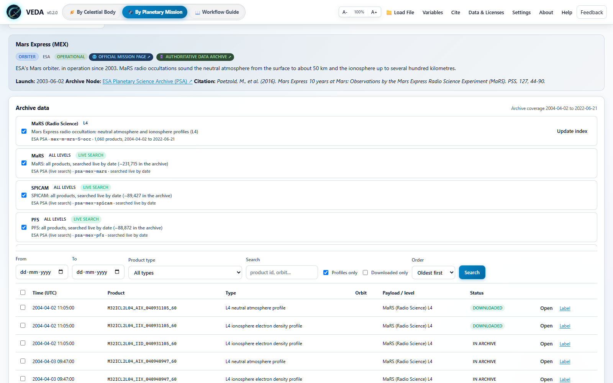
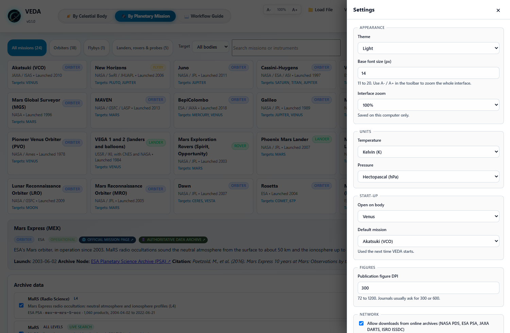

<p align="center">
  
</p>

# VEDA: Visualization, Exploration, and Data Analysis

**VEDA** is a desktop laboratory for planetary atmosphere and ionosphere data. Pick a planet or moon and a date range, and VEDA finds every product the official archives hold for it across all connected missions. You can then download the products, plot them, derive physical parameters, compare observations and compute the observation geometry with SPICE.

All data shown in VEDA come straight from the mission archives (NASA PDS, ESA PSA, JAXA DARTS, ISRO ISSDC, OPUS). Nothing is simulated. Nearly every payload of every mission in VEDA can be searched by date and plotted; the few that cannot (no searchable archive route yet) are listed in DATA_POLICY.md.

---

## Documentation

* **[User guide](USAGE.md)**: searching, plotting, comparison, geometry, export, settings and troubleshooting.
* **[Data policy and citations](DATA_POLICY.md)**: the archives and data sets VEDA reads, their terms, and what to cite.
* **[Terms of use](TERMS.md)**: warranty, responsibility for results, archive etiquette and privacy.
* **[License (MIT)](LICENSE)** and **[third-party licenses](THIRD_PARTY_LICENSES.md)**.
* **[Contributing](CONTRIBUTING.md)** and **[changelog](CHANGELOG.md)**.



| Comparison, light theme | Mission view | Settings |
|---|---|---|
|  |  |  |

---

## What you can do

### Find everything observed on a date
In **By Celestial Body**, *Find observations of ...* searches every connected data set of every mission for that body over the dates you give. Two kinds of data set are searched together:

* **Indexed data sets**: VEDA reads the archive's own catalogue (PDS3 volume and cumulative indexes, PDS4 bundles) into a local SQLite index the first time, so later searches are instant and work offline.
* **Live data sets**: whole instrument archives too large to copy are searched on the archive servers for your dates (ESA PSA EPN-TAP, the NASA PDS Registry API, the PDS Rings node OPUS). What is found is kept in the local catalogue.

For example, Mars on 2016-01-01 lists MAVEN NGIMS and IUVS, MRO CRISM, SHARAD and MCS products and Mars Express ASPERA-3, SPICAM, PFS, OMEGA and MARSIS products in one table. **Show** narrows the list to profiles, images or time series. Open any row to plot it, tick several profiles to compare them, or download them for offline work.

### Browse a mission by payload
In **By Planetary Mission**, *Archive data* lists every payload and data set of the mission (instrument, level, archive, live or indexed). Choose the ones you want and filter by date, product type, free text, profiles only or downloaded only, oldest or newest first.

### Connected archives and payloads

All 19 missions in VEDA are connected (141 data sets). Highlights:

| Body | Mission | Payloads | Route |
|---|---|---|---|
| Venus | Akatsuki | RS (L2-L4), UVI, IR1, IR2 and LIR (raw, calibrated, geometry) | JAXA DARTS, indexed |
| Venus | Venus Express | VeRa (indexed), VMC, VIRTIS, SPICAV/SOIR, ASPERA-4, MAG | ESA PSA, live |
| Venus | Magellan, Pioneer Venus | Radio occultation profiles, radar, gravity; PVO ORO, OIMS, ONMS, probes | NASA PDS |
| Mars | Mars Express | MaRS L4 profiles (indexed); SPICAM, PFS, OMEGA, ASPERA-3, MARSIS, HRSC, VMC | ESA PSA |
| Mars | MRO | MCS DDR/EDR/RDR (indexed), CRISM, SHARAD; CTX and MARCI on request | NASA PDS |
| Mars | MAVEN, MGS | NGIMS, IUVS, ACC; MGS RS profiles, TES, MOLA | NASA PDS |
| Jupiter | Juno, Galileo | MWR, JIRAM, UVS, JunoCam, MAG, gravity; Galileo SSI, NIMS, UVS, PPR, MAG, PLS, EPD, probe | NASA PDS, OPUS |
| Saturn, Titan | Cassini-Huygens | ISS, VIMS, UVIS, CIRS (OPUS), INMS, RSS Titan ionosphere; Huygens HASI, DISR, GCMS, ACP, DWE, SSP | NASA PDS, OPUS, ESA PSA |
| Pluto | New Horizons | REX, Alice, LORRI, Ralph MVIC/LEISA, SWAP, PEPSSI, SDC | NASA PDS |
| Mercury | MESSENGER, BepiColombo | MLA, GRS, NS, XRS, MAG, MASCS, RS; BepiColombo MPO-MAG, MCAM, SERENA, PHEBUS, MERTIS, MORE ... | NASA PDS, ESA PSA |
| Moon | LRO | Diviner, LOLA, LEND, Mini-RF, radio science | NASA PDS |
| Ceres, Vesta | Dawn | GRaND, gravity | NASA PDS |
| 67P | Rosetta | OSIRIS, VIRTIS, ALICE, MIRO, ROSINA, RPC, RSI, GIADA, COSIMA and the lander instruments | ESA PSA |
| Mars, Moon | MOM, Chandrayaan-2 | All payloads, via sign-in and import (ISRO PRADAN requires an account) | ISRO ISSDC |

DATA_POLICY.md lists every data set. ISRO's PRADAN portal requires a free account, so VEDA opens it for you to sign in; you download there and use **Import downloaded files**. VEDA never sees your password.

### Plot any product
Any product VEDA lists can be opened: **Open** for atmosphere profiles, **View** for everything else. The product viewer reads PDS3, PDS4, FITS and netCDF:

* **Tables and time series**: plot any field against any other (time axes, one plot or one panel per field, log scales). Large products are drawn at a few thousand points with every minimum and maximum kept.
* **Spectra per row** (energy channels, spectrometer frames): spectrograms with the mean spectrum.
* **Profiles per row** (e.g. MRO MCS, about 370 temperature, pressure, dust and ice profiles per file): plot one vector against another for any row, and overlay up to 12.
* **Images and maps**: stretch (percentile, ZScale, linear, log, sqrt, asinh, histogram), colour maps, bands, value read-out, line transects and histograms; netCDF maps (e.g. Akatsuki L3) keep their longitude-latitude axes.
* **Spectral cubes** (VIRTIS, OMEGA, VIMS, CRISM, IUVS ...): band slider and the spectrum at any clicked pixel.

Binary data are memory-mapped and images are read at screen resolution, so very large files do not fill your memory.

### Derived parameters for profiles
An opened profile shows every quantity in the product with the archived 1-sigma uncertainty where the product gives one, and its time, latitude, longitude, solar zenith angle and local time. Units are read from the label and converted (Pa, hPa, bar, mbar; K and degrees C; m^-3 and cm^-3, including scaled units). From temperature and pressure VEDA derives, with the body's own constants ($R_{spec}, c_p, g_0, P_{ref}$):

* Lapse rate $\Gamma = -dT/dz$ and gravity $g(z) = g_0 (R_p/(R_p+z))^2$
* Scale height $H = R_{spec} T / g$ and speed of sound
* Potential temperature $\theta = T (P_0/P)^{R_{spec}/c_p}$ and mass density $\rho = P/(R_{spec} T)$
* Brunt-Vaisala frequency $N^2 = \frac{g}{T}\left(\frac{dT}{dz} + \frac{g}{c_p}\right)$ and buoyancy period
* Tropopause, gravity-wave temperature perturbations and potential energy
* For ionospheres, the peak height and density and $\text{VTEC} = 10^{-7}\int N_e\,dz$ (TECU)

### Compare observations
Selected profiles from any missions are interpolated onto a common altitude grid and drawn with their mean and 1-sigma spread. Colour the curves by mission, date or latitude, switch the variable and units, and export the comparison table as CSV.

### Style and export figures
**Plot style** controls lines, markers, palettes, uncertainty bands or error bars, linear or log axes, swapped axes, altitude or pressure as the vertical axis, grid, ticks, fonts and legend, with journal templates for AGU, Elsevier (Icarus/PSS), A&A and MNRAS. It applies to profiles, comparisons, time series, spectra and images. **Export figure** writes PNG at a chosen DPI or vector SVG at the journal's single- or double-column width.

### Observation geometry with SPICE, kernels downloaded for you
**Geometry** works for every mission with public SPICE kernels (17 of 19; MOM and Chandrayaan-2 publish none):

* **Radio occultations**: the orbit around the occultation (planet-fixed and J2000), the view from Earth, the tangent-point track (cylindrical, polar or orthographic) and SZA, local time and Sun-Earth-probe angle along the profile. Times are Earth-received and light-time corrected; tangent radii agree with Mars Express's archived values to about 1 km.
* **Any other observation**: the spacecraft orbit, the sub-spacecraft ground track and altitude, local solar time and solar zenith, emission and phase angles over the observation.

When you open a mission, its generic and body kernels download in the background; when you open an observation, the spacecraft ephemeris for that date follows. VEDA knows each mission's kernel archive (NAIF, ESA SPICE service, JAXA DARTS) and how its files map to dates. Settings > Observation geometry turns this off or sets the size above which VEDA asks first. Kernels are kept and reused.

### What to cite
**Cite** lists the references for exactly what you used on this computer:
* the data sets (with the archive data set identifiers of the products you opened);
* the instrument and mission papers (checked against Crossref);
* the archive acknowledgements;
* SPICE and SpiceyPy if you used geometry, and NumPy, SciPy, Astropy, Matplotlib or Plotly for the features you used;
* VEDA itself.

It gives BibTeX, plain text and a matching data availability statement, all ready to copy.

### Your own files
**Load File** or drag and drop: PDS3 (`.lbl` + data), PDS4 (`.xml` + data), FITS, netCDF, CSV and text tables, PNG/JPEG.

---

## Installation

### Option A: download the app (no Python needed)
Open the [latest release](https://github.com/jovian-explorer/VEDA/releases/latest) and download the archive for your OS:

| OS | Asset | Run |
|---|---|---|
| Windows 10/11 (x64) | `VEDA-<version>-windows-x86_64.zip` | unzip, open the folder, double-click `VEDA.exe` (keep the `_internal` folder next to it) |
| macOS (Apple Silicon) | `VEDA-<version>-macos-arm64.zip` | unzip, right-click `VEDA.app` > Open the first time (the app is not notarized) |
| Linux (x86_64) | `VEDA-<version>-linux-x86_64.zip` | unzip, `cd VEDA-*; chmod +x VEDA && ./VEDA` |

While the repository is private you need to be signed in to GitHub with access to it.

### Option B: install with pip (any OS, Python 3.10+)
```bash
pip install "git+https://github.com/jovian-explorer/VEDA.git"
veda                  # desktop window (falls back to the browser)
veda --browser        # always use the default browser
veda-server           # headless API + web UI, prints the URL
python -m veda        # same as `veda`
```
netCDF files (classic and HDF5-based netCDF4) are read with the netCDF4 package, which is installed with VEDA.

### Option C: development setup
```bash
git clone https://github.com/jovian-explorer/VEDA.git
cd VEDA
python -m venv .venv
# Windows: .venv\Scripts\activate     macOS/Linux: source .venv/bin/activate
pip install -e ".[dev]"
pytest
```

## Running

| Command | What it does |
|---|---|
| `veda` | Starts the backend on a free local port (8765 or the next free one) and opens the native window |
| `veda --browser` | Same, but opens your default browser |
| `veda --no-window --port 8765` | Server only; open `http://127.0.0.1:8765/` yourself |
| `veda-server --host 0.0.0.0` | Serve on your network (the API has no authentication, so only do this on a trusted network) |

The interactive REST API documentation is at `/api/docs` on the same address. The archive endpoints are under `/api/veda/archive` (data sets, index, search, fetch, profile) and `/api/veda/geometry`.

**Where VEDA keeps your files** (archive index, downloaded products, SPICE kernels, exports, settings, logs):

| OS | Location |
|---|---|
| Windows | `%LOCALAPPDATA%\VEDA` |
| macOS | `~/Library/Application Support/VEDA` |
| Linux | `$XDG_DATA_HOME/VEDA` (default `~/.local/share/VEDA`) |

Set `VEDA_HOME` to use a different folder. Deleting the cache folder is safe; VEDA downloads again what it needs.

An internet connection is needed to search an archive for the first time, to download products and to fetch SPICE kernels. The bundled sample products (Akatsuki, Mars Express, Cassini) work offline. Turn **Settings > Network > Allow downloads** off to work fully offline.

## Building the standalone app

```bash
pip install -e ".[build]"
python scripts/build_exe.py            # dist/VEDA.exe, dist/VEDA.app or dist/VEDA
python scripts/build_exe.py --archive  # also zips it for distribution
```
PyInstaller cannot cross-compile, so each OS builds its own binary. Pushing a `v*` tag runs `.github/workflows/release.yml`, which builds all three and attaches them to a GitHub Release.

## Platform notes

* **Windows**: uses the Microsoft Edge WebView2 runtime (preinstalled on Windows 10/11).
* **macOS**: uses the system WebKit, so nothing extra is needed. Unsigned builds need right-click > Open the first time.
* **Linux**: the native window needs GTK or Qt bindings for pywebview, for example `sudo apt install python3-gi gir1.2-webkit2-4.1` or `pip install "pywebview[qt]"`. Without them VEDA opens in your browser automatically.

---

## Data, citation and license

VEDA does not own or host any data. Each archive's terms apply to the data you download (see [DATA_POLICY.md](DATA_POLICY.md)); the MIT License applies to the VEDA software. When you publish results, cite the data set, the instrument team's reference publication and VEDA. **Data & Licenses** in the app lists every connected data set with its citation and gives a data availability statement you can copy.

```bibtex
@software{Aggarwal_VEDA_2026,
  author       = {Keshav Aggarwal},
  title        = {{VEDA: Visualization, Exploration, and Data Analysis - A Multi-Mission Planetary Science Data Laboratory}},
  year         = {2026},
  publisher    = {Space Physics Laboratory (SPL), Vikram Sarabhai Space Centre (VSSC), ISRO},
  version      = {0.3.0},
  url          = {https://github.com/jovian-explorer/VEDA},
  address      = {Thiruvananthapuram, Kerala, India}
}
```

* **License**: [MIT](LICENSE). Copyright (c) 2026 Keshav Aggarwal, Space Physics Laboratory (SPL), Vikram Sarabhai Space Centre (VSSC), ISRO.
* **Terms of use**: [TERMS.md](TERMS.md). VEDA is provided without warranty, has no accounts, analytics or telemetry, and contacts only the archives you search.
* **Third-party software**: [THIRD_PARTY_LICENSES.md](THIRD_PARTY_LICENSES.md) (Plotly.js, KaTeX, FastAPI, Pydantic, SpiceyPy/CSPICE, NumPy, SciPy, Astropy, Matplotlib, Pillow, Requests, Uvicorn, PyWebView).
* VEDA is not affiliated with or endorsed by NASA, ESA, JAXA or ISRO.

---

## Project layout and tests

```
src/veda/archives/   archive data sets, catalogue index, downloads, profile loading
src/veda/geometry/   SPICE kernel planning/download and observation geometry
src/veda/readers/    PDS3, PDS4, FITS and text readers
src/veda/analysis/   derived atmospheric and ionospheric parameters
src/veda/api/        FastAPI backend
src/veda/frontend/   web UI (Plotly and KaTeX bundled for offline use)
src/veda/sampledata/ real archive products used by the demos and tests
packaging/           PyInstaller spec, entry script and icon
scripts/             build_exe.py
tests/               pytest suite
```

```bash
pytest                          # full suite
pytest tests/test_archives.py   # a single module
```
CI runs the suite on Windows, macOS and Linux for every push to `main`. The Windows exe launch tests in `tests/test_explorer_launch.py` run after `python scripts/build_exe.py` and skip otherwise.

---

## Author

**Keshav Aggarwal**, Research Associate, Space Physics Laboratory (SPL), Vikram Sarabhai Space Centre (VSSC), Indian Space Research Organisation (ISRO), Thiruvananthapuram, Kerala, India. Formerly Prime Minister's Research Fellow, Department of Astronomy, Astrophysics and Space Engineering (DAASE), IIT Indore.

Research: planetary radio occultation, planetary atmospheres and ionospheres, solar wind velocity and turbulence, and coronal electron density.

Website: [https://jovian-explorer.github.io/](https://jovian-explorer.github.io/)
