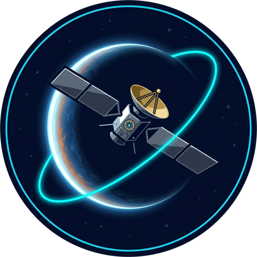

<p align="center">
  
</p>

# VEDA — Visualization, Exploration, and Data Analysis

**VEDA** is a general multi-mission planetary-science data laboratory capable of discovering, downloading, processing, analyzing, visualizing, and comparing scientific observations across multiple robotic spacecraft missions and celestial bodies.

---

## Key Capabilities

### 1. Standalone Windows Executable (.exe Package)
VEDA is engineered to build as a native, single-file standalone Windows desktop application:
* **Output Binary**: `dist\VEDA.exe` (self-contained, with native WebView2 GUI and embedded static assets).
* **Explorer Double-Click Resilient**: Automatically detects and handles non-terminal Explorer execution contexts, setting internal working directories from `sys._MEIPASS` and falling back cleanly to the system browser if needed.
* **Build Script**: `.\package_exe.ps1` builds the package in one command via PyInstaller.

### 2. Dual Exploration Paradigms

#### A. By Celestial Body
Explore any non-Earth target planetary body or satellite:
* **Venus** (Akatsuki, Venus Express, Magellan, Pioneer Venus Orbiter, BepiColombo)
* **Mars** (MAVEN, Mars Reconnaissance Orbiter)
* **Jupiter** (Juno, Galileo, Cassini, New Horizons)
* **Saturn** (Cassini-Huygens)
* **Titan** (Cassini-Huygens)
* **Pluto & Arrokoth** (New Horizons)
* **Mercury** (MESSENGER, BepiColombo)
* **Moon** (Lunar Reconnaissance Orbiter)
* **Ceres** (Dawn)
* **Vesta** (Dawn)
* **Comet 67P/C-G** (Rosetta)

**Multi-Mission Simultaneous Selection**:
* Select multiple missions simultaneously (e.g. Venus: **Akatsuki** + **Venus Express** + **BepiColombo**).
* Aligns compatible atmospheric soundings onto a common body-specific vertical grid.
* Computes multi-spacecraft **composite mean $\mu(z)$** and **$\pm 1\sigma$ spread envelopes**.
* Interactive Plotly visualization showing individual spacecraft curves overlaid with the composite.
* One-click CSV export of cross-mission comparison tables.
* **🏛️ Publication Figure Generator**: Generates 300-DPI publication-ready figures with LaTeX mathematical typography.

#### B. Planetary Spatial Coordinates Map & 3D Globe
* **2D Cylindrical Equirectangular Projection**: Visualizes observation locations, ray tangent points, and camera footprints with latitude and longitude guide bands.
* **3D Orthographic Rotating Globe**: Mathematical wireframe representation of the planetary body with latitude parallels and longitude meridians, plotting mission observation markers in true 3D coordinates.
* **Cross-Mission Synchronization**: Color-coded mission markers, observation tooltips, and click-to-highlight synchronization with the soundings table.

#### C. By Mission
Dive into specific spacecraft architectures with accurate mission classification:
* **Orbiters**: Akatsuki, Juno, Cassini, Venus Express, MAVEN, BepiColombo, Galileo, MESSENGER, Magellan, PVO, LRO, MRO, Dawn, Rosetta.
* **Flybys & Encounters**: New Horizons (Pluto, Arrokoth, Jupiter gravity assist), BepiColombo Venus flybys, Galileo Venus flyby.
* **Multi-level Data Pipeline**: Raw $\to$ Calibrated $\to$ Derived $\to$ User Analysis $\to$ Visualization $\to$ Export.
* **Astronomical Imaging & Interactive FITS Canvas**:
  - Full astronomical contrast stretching: **ZScale**, **Percentile (0.5%–99.5%)**, **Linear**, **Log**, **Sqrt**, **Asinh**, **Histogram Equalization**.
  - Scientific palettes: Inferno, Viridis, Plasma, Magma, Grayscale, Twilight.
  - **Live Pixel Coordinate Inspector**: Real-time crosshair tracking displaying native image coordinates `(X, Y)` under the cursor.
  - **Click-and-Drag Custom Transect Slicing**: Scientists can drag a line slice directly across planetary cloud bands, surface features, or atmospheric limbs $(x_0, y_0) \to (x_1, y_1)$ to instantly extract 1D calibrated photometric flux cross-sections and 60-bin pixel value histograms/CDFs.

---

### 3. Remote Archive Discovery & Streaming Downloader

* **International Planetary Archives**: Direct queries to NASA Planetary Data System (PDS), ESA Planetary Science Archive (PSA), and JAXA DARTS / ISAS.
* **Live Progress & Cataloging**: Background streaming chunked downloader with byte tracking, SHA-256 verification, and SQLite cataloging via `/api/veda/archive/download` and `/api/veda/archive/tasks/{task_id}`.
* **In-App Search UI**: Query remote archives by agency and keyword directly within Mission Mode.

---

### 4. Multi-Planet Thermodynamic Engine

Applies target-specific physical constants ($R_{spec}, c_p, g_0, P_{ref}$) to compute:
* **Environmental Lapse Rate**: $\Gamma = -\frac{dT}{dz}$
* **Altitude-Dependent Gravity**: $g(z) = g_0 \left(\frac{R_p}{R_p + z}\right)^2$
* **Atmospheric Scale Height**: $H(z) = \frac{R_{spec} T(z)}{g(z)}$
* **Poisson Potential Temperature**: $\theta(z) = T(z) \left(\frac{P_0}{P(z)}\right)^\kappa$ where $\kappa = \frac{R_{spec}}{c_p}$
* **Static Stability / Brunt-Väisälä Buoyancy Frequency**:
  $$N^2(z) = \frac{g(z)}{\theta(z)} \frac{\partial \theta}{\partial z} = \frac{g(z)}{T(z)} \left(\frac{\partial T}{\partial z} + \frac{g(z)}{c_p}\right)$$
* **Ionospheric Vertical Total Electron Content (VTEC)**:
  $$\text{VTEC} = 10^{-7} \int N_e(z) dz \quad [\text{TECU}]$$

---

### 5. Pure-Python Readers (Zero PVL / Heavy C Dependencies)

* **PDS3 Label & Table Reader** (`pds3_reader.py`):
  - Parses fixed-width and CSV `.TAB` / `.LBL` data without third-party PVL libraries.
  - Automatically handles column byte-offsets, units, sentinel values (`-999.0`, `-9999.0`), and missing constants.
  - Tested and verified on authentic JAXA Akatsuki Level 4 radio science data.
* **FITS Astronomical Image Reader** (`fits_reader.py`):
  - Reads multi-extension FITS files using `astropy.io.fits`.
  - Computes robust astronomical percentile intervals and renders high-fidelity PNG streams on the fly.
* **NetCDF-4 Reader** (`readers.py`):
  - High-performance extraction of GNSS radio occultation profile granules.

---

## Quick Start

### Running from Pre-built Executable
```powershell
# Double-click or run from terminal:
.\dist\VEDA.exe
```

### Building the Standalone Executable (.exe)
```powershell
.\package_exe.ps1
```

### Launching in Development Mode
```powershell
# Method 1: PowerShell launcher (starts app and opens browser)
.\launch.ps1

# Method 2: Direct Python launch
python app.py

# Method 3: Server-only mode (headless)
python app.py --no-window --port 8765
```

Navigate to: `http://127.0.0.1:8765/`
Interactive REST API documentation: `http://127.0.0.1:8765/api/docs`

---

## Verification Test Suites

```powershell
python -m pytest tests/ -v
```

Total Test Count: **91 Tests Passing (100% Success Rate)**
* `tests/test_veda.py`: 15 passed
* `tests/test_wave_and_stability.py`: 3 passed
* `tests/test_advanced_science.py`: 22 passed
* `tests/test_cosmic2.py`: 36 passed
* `tests/test_pipeline.py`: 10 passed
* `tests/test_explorer_launch.py`: 5 passed
